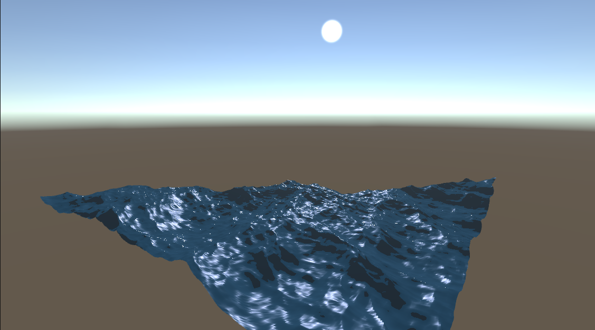

# OceanSim-IFFT

Ocean wave simulation using IFFT

This is based on the following papers:
[Simulating ocean water by Jerry Tessendorf](https://www.researchgate.net/publication/264839743_Simulating_Ocean_Water)
[Realtime GPGPU FFT Ocean Water Simulation by FJ Flügge](https://tore.tuhh.de/handle/11420/1439?locale=en)

The core idea behind the method is to synthesise realistic ocean waves by efficently combining a large number of waves generated by a statistical model using Fast Fourier Transform.

This is still work in progress:
- Foams with Jacobians
- LOD based on view distance
- More realistic lighting
- Experiment with different spectrums

